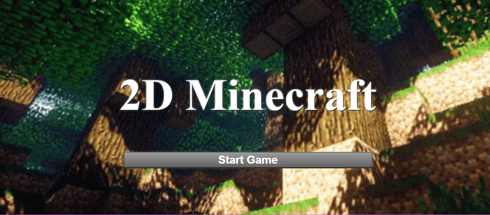
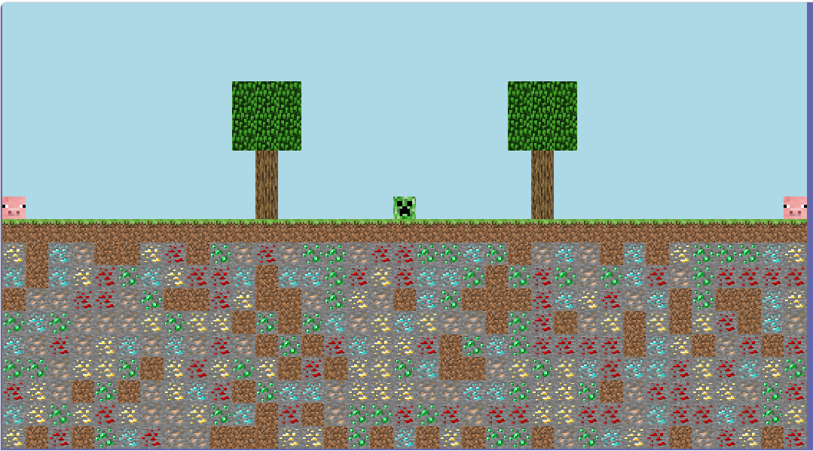
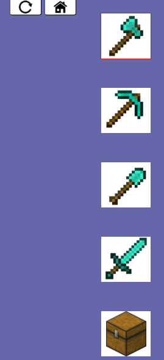
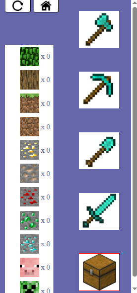
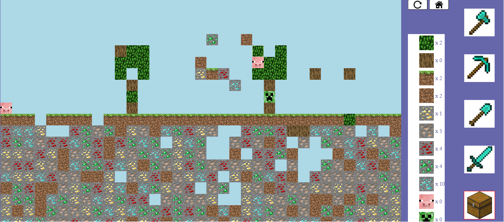
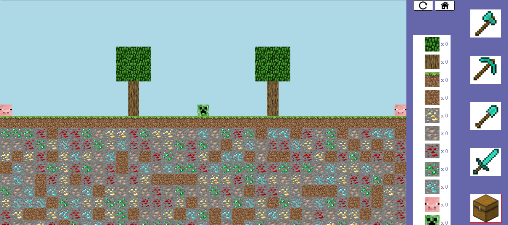

# 🟩 2D Minecraft Game

A simple **2D Minecraft-inspired game** built using **HTML, CSS, and JavaScript**.

This project was created as part of my practice with DOM manipulation, event listeners, responsive design, CSS styling, and basic game logic. The game allows the player to interact with a generated world, choose tools, break blocks, collect items in the inventory, and place blocks back into the world.

---

## 🎮 Project Overview

The game starts with an animated home screen that includes a title and a start button. After clicking the start button, the player enters the game world.

The world is generated dynamically using JavaScript(most importantly it is responsive). It contains sky, dirt, trees, stones, animals, and a creeper. The player can choose the correct tool to remove specific blocks or characters, collect them in the inventory, and place collected blocks back into empty sky tiles.

---

## ✨ Features

* Animated home screen with a start button
* Dynamically generated 2D world
* Responsive tile sizing based on screen dimensions
* Different block types such as:

  * Sky
  * Dirt
  * Grass dirt
  * Oak
  * Leaves
  * Gold
  * Iron
  * Diamond
  * Emerald
  * Ruby
* Characters such as:

  * Pig
  * Creeper
* Tool system:

  * Axe
  * Pickaxe
  * Shovel
  * Sword
  * Inventory
* Tool/block matching logic
* Inventory system with item counters
* Ability to place collected blocks back into the world
* Sound effects when breaking blocks or placing blocks
* Reset button to generate a new world
* Home button to return to the home screen

---

## 🛠️ Technologies Used

* HTML
* CSS
* JavaScript
* DOM Manipulation
* Event Listeners
* CSS Animations
* Audio Elements

---

## 🧠 What I Practiced

During this project, I practiced:

* Creating HTML structure for a game layout
* Styling a full-screen game interface with CSS
* Using `position`, `z-index`, and layout techniques
* Creating an animated home screen
* Generating elements dynamically using JavaScript
* Working with arrays and nested loops
* Using event listeners for player interaction
* Handling selected tools and selected inventory items
* Updating `data-count` values in the inventory
* Playing sounds through JavaScript
* Using `classList.add()`, `classList.remove()`, `classList.toggle()`, and `classList.contains()`
* Making parts of the game responsive to screen size

---

## 📸 Screenshots

### Home Screen



---

### Game World



---

### Tool Selection



---

### Inventory System



---

### Modified Map



---

### OverAll Lookup on the Project



---

## 🚀 How to Run the Project

1. Clone or download the project.
2. Open the project folder in VS Code.
3. Make sure all images and sounds are inside the correct folders.
4. Open `index.html` in the browser.
5. Click **Start Game** and play.

Recommended folder structure:

```txt
project-folder/
│
├── index.html
├── styles.css
├── script.js
│
├── images/
│   ├── minecraft-background.gif
│   ├── dirt(with grass).jpg
│   ├── dirt(no grass).jpg
│   ├── oak.jpg
│   ├── leaf.jpg
│   ├── creeper.jpg
│   ├── pig.jpg
│   ├── gold.jpg
│   ├── iron.jpg
│   ├── ruby.jpg
│   ├── emerald.jpg
│   ├── diamond.jpg
│   ├── axe.jpg
│   ├── pickaxe.jpg
│   ├── shovel.jpg
│   ├── sword.jpg
│   ├── inventory.jpg
│   ├── reset.jpg
│   └── home.jpg
│
├── sounds/
│   ├── minecraftCreeperDyingSound.mp3
│   ├── minecraftPigDyingSound.mp3
│   ├── minecraftLeafBreakingSound.mp3
│   ├── minecraftOakBreakingSound.mp3
│   ├── minecraftDirtBreakingSound.mp3
│   ├── minecraftDiamondBreakingSound.mp3
│   ├── minecraftIronBreakingSound.mp3
│   └── BlocksPlacingSound.mp3
│
└── screenshots/
    ├── home-screen.png
    ├── game-world.png
    ├── tool-selection.png
    ├── inventory-system.png
    ├── modified-map.png
    └── map-world.png
```

---

## 🎯 Game Logic

Each block type requires a specific tool:

| Block / Character | Required Tool |
| ----------------- | ------------- |
| Dirt              | Shovel        |
| Grass Dirt        | Shovel        |
| Oak               | Axe           |
| Leaves            | Axe           |
| Gold              | Pickaxe       |
| Iron              | Pickaxe       |
| Emerald           | Pickaxe       |
| Diamond           | Pickaxe       |
| Ruby              | Pickaxe       |
| Pig               | Sword         |
| Creeper           | Sword         |

When the correct tool is selected and the player clicks a matching block, the block is removed and added to the inventory.

---

## 🔊 Sound Effects

The game includes sound effects for different actions, such as:

* Breaking dirt
* Breaking leaves
* Breaking oak
* Mining ores
* Removing pig/creeper
* Placing blocks

The sounds are connected using HTML `<audio>` elements and played through JavaScript when the player interacts with the world.

---

## 📌 Notes

This project was built without any frameworks or libraries. The main goal was to practice pure HTML, CSS, and JavaScript while creating an interactive browser game.

It helped me better understand how DOM elements, classes, events, sounds, and game logic can work together in one project.

DO NOT MAKE THE SCREEN ZOOM IN TOO BIG CAUSE THE BORDER OVER THE USED TOOL/TILE WOULD BE TOO BIG, MAKE IT 50% OR LESS

---

## 👨‍💻 Author

Created by **Mohamad Amer**.
